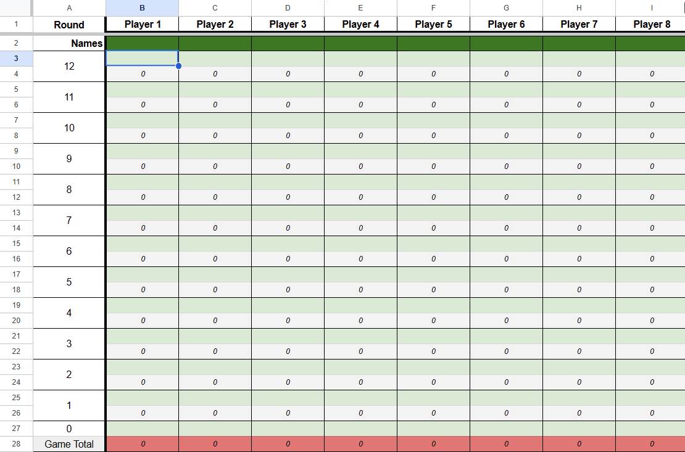
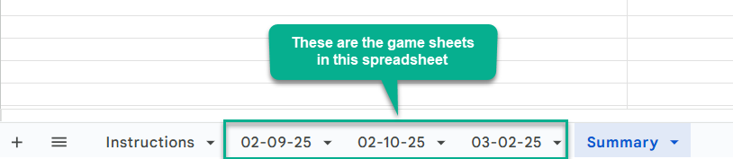
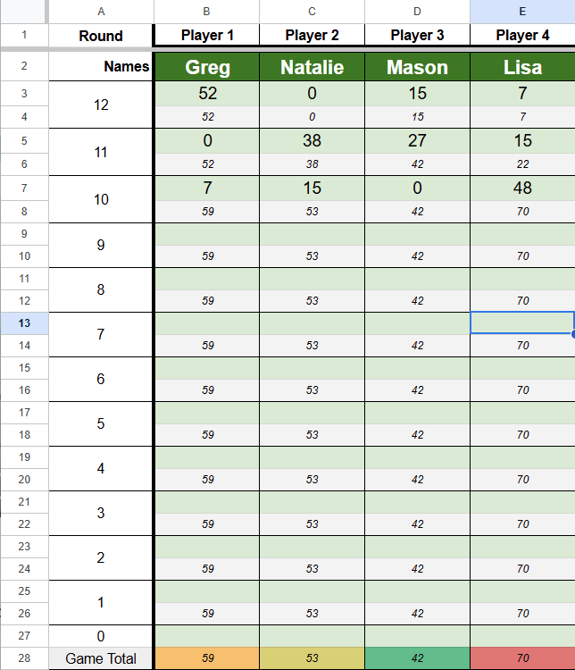
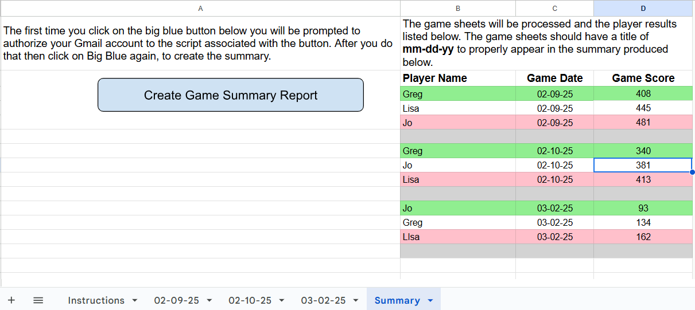
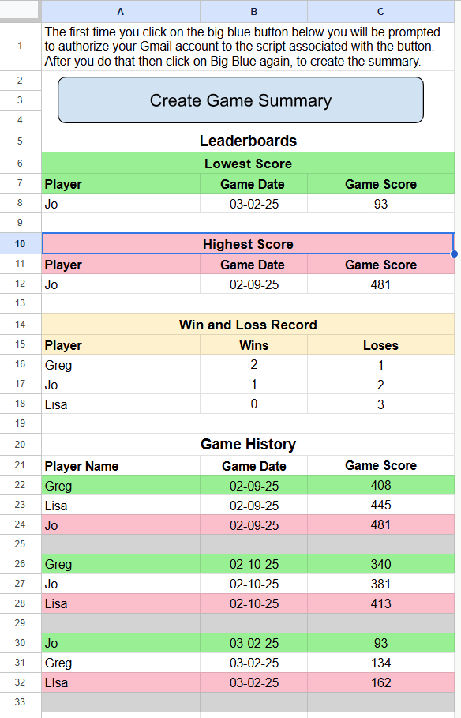

# MX Train Spreadsheet
The scripts folder contains a Google Apps script (**script.gs** file) that generates a dashboard in Greg Hughlett's MX Train Google spreadsheet

## Script Highlights
The script is launched by the Big Blue button in the Summary sheet. It performs the following steps in sequence.

### Initialization logic
1. Set various variables, enums and constructs.
2. Capture the game sheets in the spreadsheet. The Instructions, game sheet template and Summary tab will be ignored here.
3. Perform some defensive programming to ensure there is at least one game sheet and a Summary sheet.

### Parse Game Sheets
1. For Each game sheet, do the following steps.
2. Retrieve Player name, game date, and score and added to Players array.
3. At the end of the game sheet parsing, sort the Players array in score order.

### Transfer Sorted Players to Summary
1. The first row in the sorted players array is the lowest and the game winner. It is highlighted in green.
2. The last row in the sorted players array is the highest and a game loser. It is highted in pink.

## Videos
|[How to use the MX Train Spreadsheet](https://go.screenpal.com/watch/cTeVoFn1Dz3)
## Gamesheet Template
This sheet should **not** be deleted from the spreadsheet as it is used to create another game sheet.

## Game Sheets in the Spreadsheet

## Game Sheet Highlighting
A new game sheet provides a means to quickly assess who's winning (dark green) or losing (pink) in a game by the highlighting performed in the last row of the game sheet, as shown below.

## Current Summary Sheet

## V2 Summary Sheet

