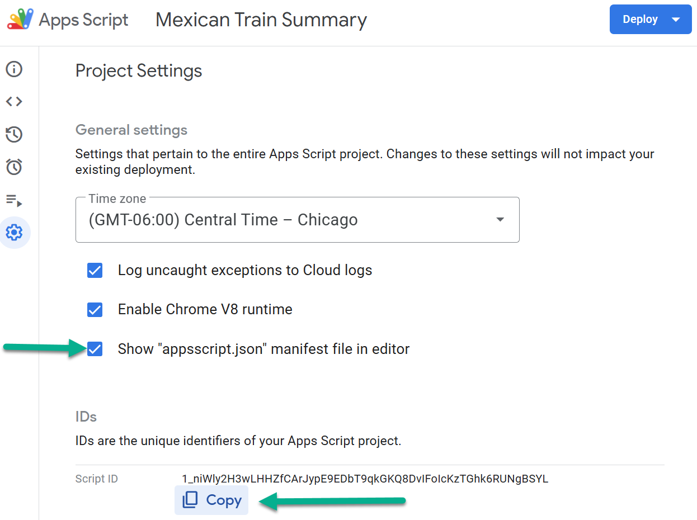

# MX Train Spreadsheet
The scripts folder contains a Google Apps script (**script.gs** file) that generates a dashboard in Greg Hughlett's MX Train Google spreadsheet

## Script Highlights
The script is launched by the Big Blue button in the Summary sheet. It performs the following steps in sequence.

### Initialization logic
1. Set various variables, enums and constructs.
2. Capture the game sheets in the spreadsheet. The Instructions, game sheet template and Summary tab will be ignored here.
3. Perform some defensive programming to ensure there is at least one game sheet and a Summary sheet.

### Parse Game Sheets
1. For Each game sheet, do the following steps.
2. Retrieve Player name, game date, and score and added to Players array.
3. At the end of the game sheet parsing, sort the Players array in score order.

### Transfer Sorted Players to Summary
1. The first row in the sorted players array is the lowest and the game winner. It is highlighted in green.
2. The last row in the sorted players array is the highest and a game loser. It is highted in pink.

## Videos
|[How to use the MX Train Spreadsheet](https://go.screenpal.com/watch/cTeVoFn1Dz3)
## Gamesheet Template
This sheet should **not** be deleted from the spreadsheet as it is used to create another game sheet.


## Game Sheets in the Spreadsheet

## Game Sheet Highlighting
A new game sheet provides a means to quickly assess who's winning (dark green) or losing (pink) in a game by the highlighting performed in the last row of the game sheet, as shown below.


## Current Summary Sheet

## V2 Summary Sheet


# Project Setup
* Clone the project from GitHub into VS code: *https://github.com/greg1951/MX-Train-Spreadsheet.git*
    * Of course, you need access to this private repository
* When creating a project in VS Code, always create a *src* directory.
    * Be sure to edit the ".js" file in the "src" directory, not the ".gs" file in the scripts directory.
* Install node.js and run *node -v* in the VS Code terminal to confirm
* Install npm and run *node -v* in the VS Code terminal to confirm 
* |[Watch this YouTube video on how to setup](https://www.youtube.com/watch?v=4Qlt3p6N0es)
    * When asked to turn on the Google Apps API, go to the top settings for Google Apps, not in the project settings
    * To login to Google from VS code run the **clasp login** command in the VS Code terminal window. The first time, follow the prompts to provide permission to authenticate VS Code to Google.
        * You need to login before running the clasp clone command below.
    * You will need the script ID of the project and for that, go to the settings/properties of the MX Train Spreadsheet project and copy the project ID to the clipboard (see below)
        
    * The clasp clone command was hard to read in the video. 
    ```
    clasp clone "1_niWly2H3wLHHZfCArJypE9EDbT9qkGKQ8DvIFoIcKzTGhk6RUNgBSYL" --rootDir src 
    ```
    * In the 2nd parameter in the above clone command, copy the project ID value **inside double quotes**
        * Verify you have a **src** directory in your project and you are prepending the argument with **--rootDir**
    * When making changes locally in VS Code *clasp push* command in the Terminal to upload to Google Apps.
        * Use the **clasp push -w** command to automatically push changes from VS Code to Google Apps
    * **Bug alert**: Move the *src/.clasp.json* file to the root directory, otherwise the clasp push and pull commands will not work.

